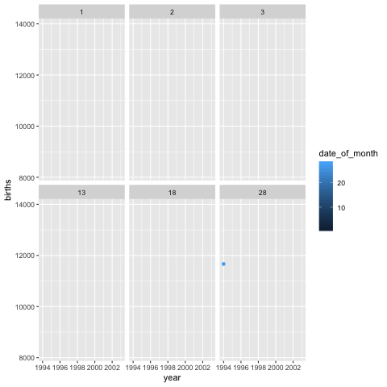

transition\_components
================
Anna Quaglieri
22/11/2018

``` r
library(gganimate)
library(tidyverse)
library(fivethirtyeight)
library(emo)
devtools::install_github("hadley/emo")
devtools::install_github("ropenscilabs/icon")
library(icon)
# List all the transitions
#ls("package:gganimate")
```

To understand how `transition_component` works I will use the `US_births_1994_2003` dataset from the `fivethirtyeight` package. The title of the article where this data was used is *Some People Are Too Superstitious To Have A Baby On Friday The 13th*. Is that true?

``` r
head(US_births_1994_2003)
```

    ## # A tibble: 6 x 6
    ##    year month date_of_month date       day_of_week births
    ##   <int> <int>         <int> <date>     <ord>        <int>
    ## 1  1994     1             1 1994-01-01 Sat           8096
    ## 2  1994     1             2 1994-01-02 Sun           7772
    ## 3  1994     1             3 1994-01-03 Mon          10142
    ## 4  1994     1             4 1994-01-04 Tues         11248
    ## 5  1994     1             5 1994-01-05 Wed          11053
    ## 6  1994     1             6 1994-01-06 Thurs        11406

Some key points to keep in mind:

You need **id** and **time** components. The `transition_component` function is useful when you have the same subject (a plane, a day, a person, a neighborood etc..) with multiple observation over time.

The first thing to keep in mind

``` r
library(ggrepel)

fridays <- US_births_1994_2003 %>% 
  filter(day_of_week %in% c("Fri") & date_of_month %in% c(1,2,3,13,18,28))
table(fridays$date_of_month)
```

    ## 
    ##  1  2  3 13 18 28 
    ## 17 16 17 16 17 19

``` r
p=ggplot(fridays) + 
  geom_point(aes(x=year,y=births,colour=date_of_month)) +
  facet_wrap(~date_of_month)+
  transition_components(id=factor(date_of_month),time=date)+
  shadow_trail(distance = 0.01, size = 0.3)

animate(p, 200, 10,duration=20)
```


